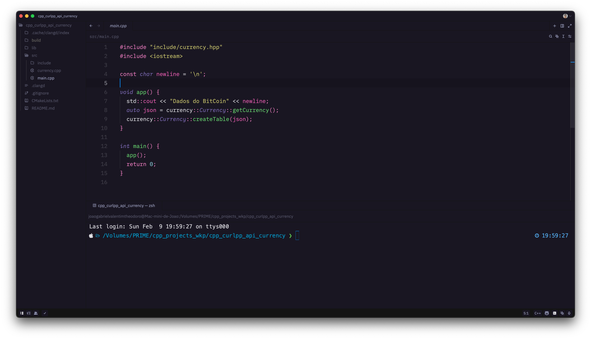

<h1 align="center">
      
    Omni for <a href="https://zed.dev">Zed Code Editor</a>
</h1>

  <strong>Dark theme for Zed Code Editor</strong>

  
  

  <a href="#install">Install</a> •
  <a href="#author">Athour</a> •
  <a href="#license">License</a> •
  <a href="#inspired">Inspired</a>   

 

<h2 tabindex="-1" class="heading-element" dir="auto" id="install">Install</h2>

All instructions can be found at <a href="INSTALL.md">INSTALL.md</a>.

<h2 tabindex="-1" class="heading-element" dir="auto" id="author">Author</h2>

<table>
<thead>
<tr>
<th></th>
</tr>
</thead>
<tbody>
<tr>
<td><a href="https://github.com/JoaoGaValentim">Joao Gabriel Valentim Theodoro</a></td>
</tr>
</tbody>
</table>

<h2 tabindex="-1" class="heading-element" dir="auto" id="license">License</h2>

<a href="LICENSE.md">MIT License</a>

<h2 tabindex="-1" class="heading-element" dir="auto" id="inspired">Inspired</h2>

<a href="https://github.com/getomni/visual-studio-code">Omni for VSCode</a>

